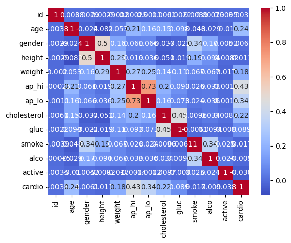

# Cardiovascular Disease Prediction

Cardiovascular Disease Prediction is a machine learning-based application designed to predict the risk of cardiovascular diseases. By inputting personal health data such as age, gender, height, weight, blood pressure (systolic and diastolic), cholesterol levels, glucose levels, and lifestyle factors like smoking, alcohol consumption, and physical activity, the model evaluates the likelihood of an individual being at risk for heart disease.

The application uses a trained machine learning model, typically a classification algorithm, to make predictions based on the provided inputs. The user-friendly interface allows individuals to easily enter their data and receive an instant prediction, indicating whether they are at risk or not.

This tool can help individuals take proactive steps toward better health by raising awareness of potential cardiovascular risks and encouraging regular medical check-ups for preventive care.

Author - Atharva Kailas Harane
Corizo Major Project
Title - Cardiovascular Disease Prediction

use below command to run project

Output:-
1)  # Display the features in dataset

id             0
age            0
gender         0
height         0
weight         0
ap_hi          0
ap_lo          0
cholesterol    0
gluc           0
smoke          0
alco           0
active         0
cardio         0
dtype: int64

2) # DATA PRE-PROCESSING METHODS

3) # Cardiovascular Disease Prediction

